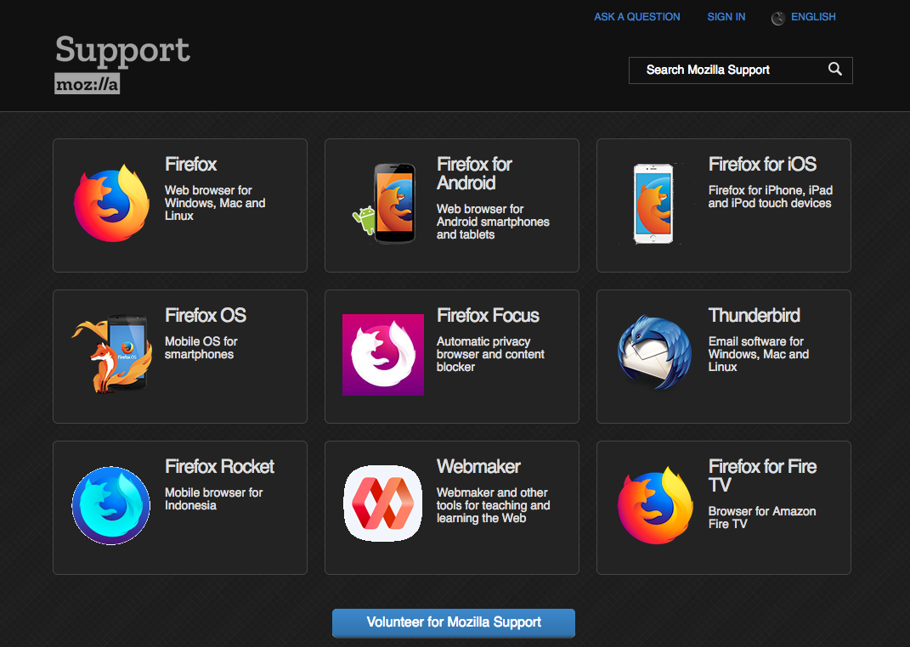
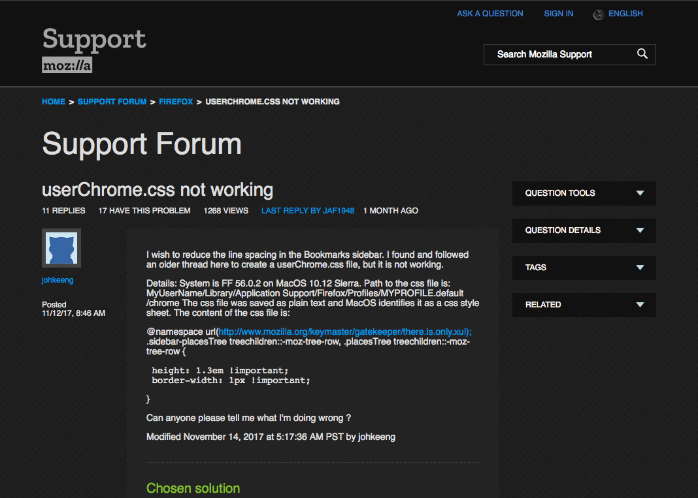
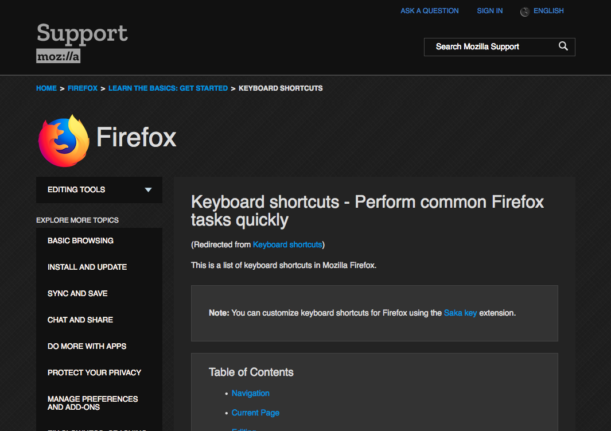

# SUMO-Dark

A dark theme designed for https://support.mozilla.org

# Status

This theme is still in development.  Please report any problems by opening a new [issue](https://github.com/overdodactyl/SUMO-Dark/issues) or messaging me on Reddit (u/overdodactyl).

# Sample Screenshots

# Usinge SUMO-Dark

Copy and paste the contents of `SUMO_Dark.css` into an extension such as [Stylus](https://addons.mozilla.org/en-US/firefox/addon/styl-us/).

Set the style to Apply on `URLs on the domain` `support.mozilla.org`.

Once the theme is more finalized, I will host it on https://userstyles.org/ and most likely include it in [ShadowFox](https://github.com/overdodactyl/ShadowFox).
